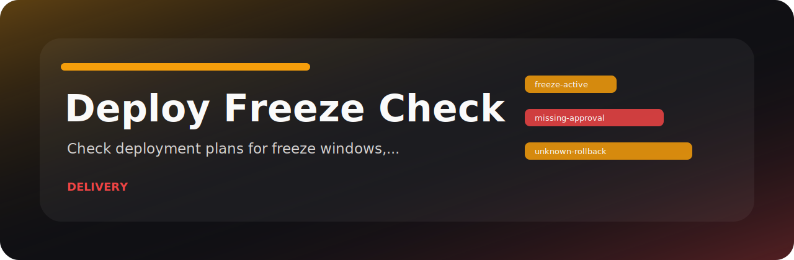

# Deploy Freeze Check

Check deployment plans for freeze windows, approvals, and rollback readiness. The idea is simple: give Deploy Freeze Check the local file or fixture, get a readable result, and decide what needs attention before the next handoff.

## Project card



| Detail | Value |
| --- | --- |
| Area | delivery and infrastructure |
| Command | `deploy-freeze-check` |
| Example | `examples/sample.txt` |

## What would make me stop a review

| Stopper | Level | Why it matters |
| --- | --- | --- |
| `freeze-active` | high | deployment overlaps a freeze window |
| `missing-approval` | medium | approval is missing |
| `unknown-rollback` | low | rollback readiness is unclear |

## Run from a fresh clone

```bash
git clone https://github.com/mertefekurt/deploy-freeze-check.git
cd deploy-freeze-check
python -m venv .venv
source .venv/bin/activate
python -m pip install -e ".[dev]"
deploy-freeze-check examples/sample.txt
deploy-freeze-check examples/sample.txt --json
```
