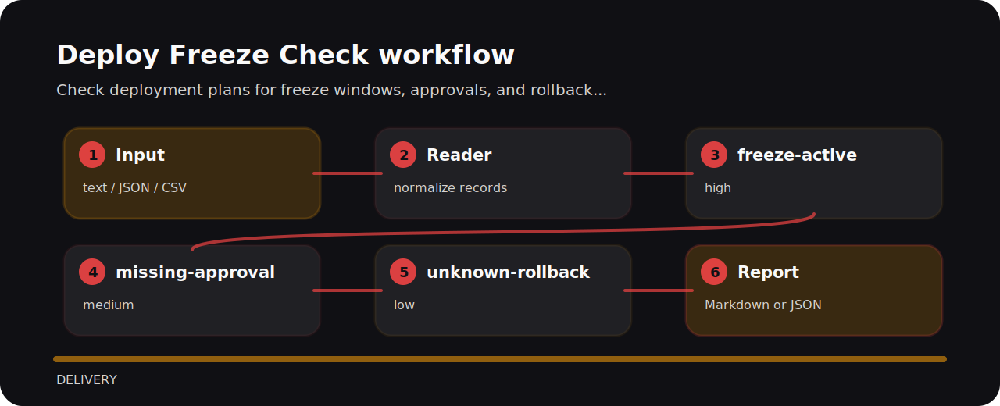

# Deploy Freeze Check


Check deployment plans for freeze windows, approvals, and rollback readiness.

## Example lines

```text
risky: deploy friday 18:00 freeze active approval missing rollback unknown
clean: deploy tuesday 10:00 freeze clear approval change-board rollback documented
```

## Review notes

| Signal | Level | What it flags | Fix direction |
| --- | --- | --- | --- |
| `freeze-active` | high | deployment overlaps a freeze window | Get exception approval or reschedule. |
| `missing-approval` | medium | approval is missing | Record approver and change ticket. |
| `unknown-rollback` | low | rollback readiness is unclear | Attach rollback plan and owner. |

## Finding map



## Try the fixture

```bash
git clone https://github.com/mertefekurt/deploy-freeze-check.git
cd deploy-freeze-check
python -m pip install -e ".[dev]"
deploy-freeze-check examples/sample.txt
```
